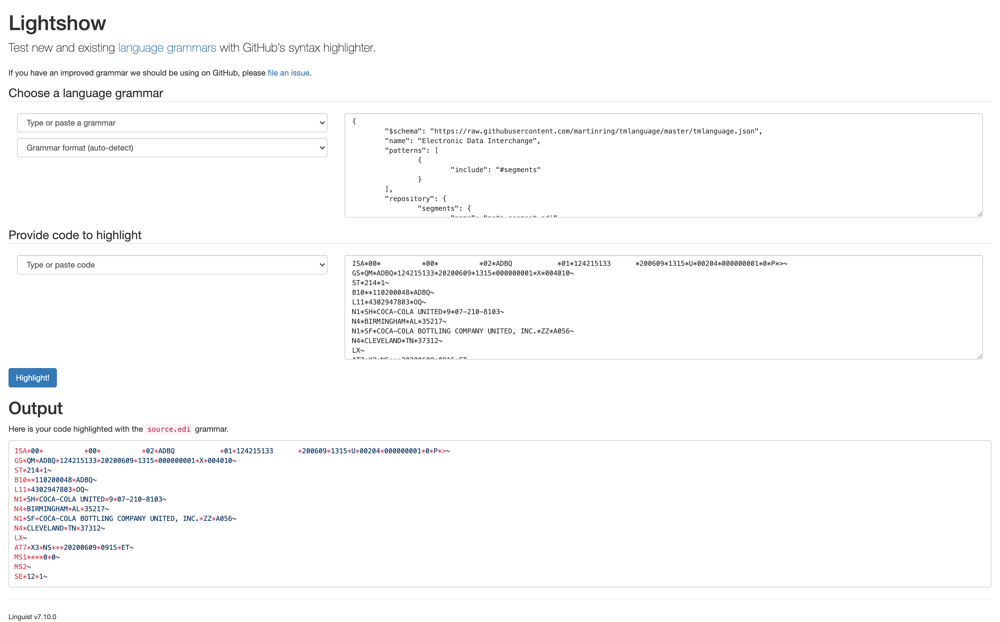

# EDI Linguist

> Enabling Linguist Support for `*.edi`

## Abstract
EDI is a data format used by the supply chain and healthcare industries. Support for such files is not available on GitHub

EDI consists of text data, and the text is restricted to using specific ASCII characters. A basic character set is defined for all exchanges, and this set may be extended with additional characters by mutual agreement of the trading partners.

[More information available through here](https://ft-docs.netlify.app/concepts/message-design/)

## Motivation
Enabling support for EDI based data files

## Examples

### Language Highlighting

1. Visit the [lightshow app online](https://github-lightshow.herokuapp.com/)

2. Copy and paste `edi.tmlanguage.json` under `Choose a language grammar`
[edi.tmlanguage.json](edi.tmlanguage.json)

3. Copy and paste `example.edi` under `Provide code to highlight`.
[example.edi](example.edi)

4. Click `Highlight`

5. An image below should populate 

### Files

Additional files include 

- SEF (Rules file, similar to INI)
- AS2 Protocol Transfer example with MIME content headers
- Example file using a ` | ` as a delimiter instead of `~`

## License 

Mozilla Public License 2.0